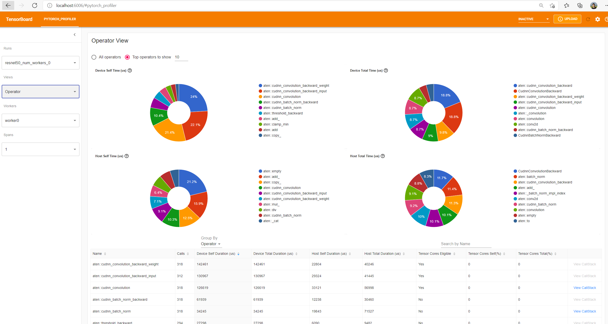
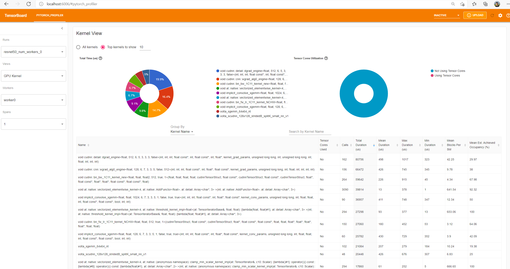
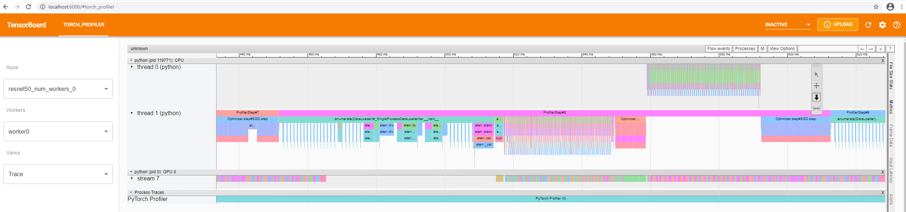
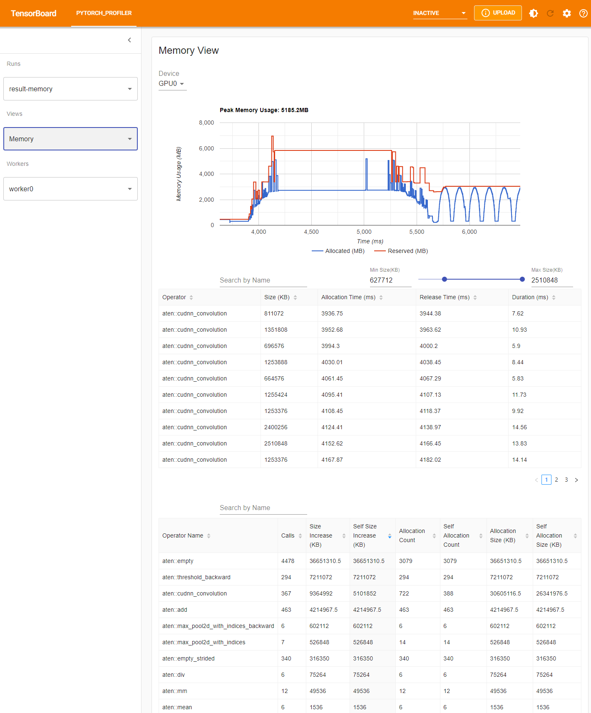

# PyTorch Profiler TensorBoard Plugin

This is a TensorBoard Plugin that provides visualization of PyTorch profiling.
It can parse, process and visualize the PyTorch Profiler's dumped profiling result,
and give optimization recommendations.

### Quick Installation Instructions

* Install from pypi

  `pip install torch-tb-profiler`

  To install with S3 / AzureBlob / GCS / HDFS extension, `pip install torch-tb-profiler[s3/blob/gs/hdfs]`, for example `pip install torch-tb-profiler[s3]`

* Or you can install from source

  Clone the git repository:

  `git clone https://github.com/pytorch/kineto.git`

  Navigate to the `kineto/tb_plugin` directory.

  Install with command:

  `pip install .`

* Build the wheel
  - `python setup.py build_fe sdist bdist_wheel` \
   **_Note_**: the build_fe step need setup yarn and Node.js
  - `python setup.py sdist bdist_wheel`

### Quick Start Instructions

* Prepare profiling data

  We have prepared some sample profiling data at [kineto/tb_plugin/samples](./samples)
  You can download it directly.
  Or you can generate these profiling samples yourself by running
  [kineto/tb_plugin/examples/resnet50_profiler_api.py](./examples/resnet50_profiler_api.py).
  Also you can learn how to profile your model and generate profiling data from [PyTorch Profiler](https://pytorch.org/tutorials/intermediate/tensorboard_profiler_tutorial.html?highlight=tensorboard).

  Note: The recommended way to produce profiling data is assigning `torch.profiler.tensorboard_trace_handler`
  to `on_trace_ready` on creation of `torch.profiler.profile`.

* Start TensorBoard

  Specify the profiling data folder to `logdir` in TensorBoard. If you use the above samples data, start TensorBoard with:

  `tensorboard --logdir=./samples`

  If your web browser is not in the same machine that you start TensorBoard,
  you can add `--bind_all` option, such as:

  `tensorboard --logdir=./samples --bind_all`

  Note: Make sure the default port 6006 is open to the browser's host.

* Open TensorBoard in Chrome browser

  Open URL `http://localhost:6006` in the browser.
  If you use `--bind_all` in tensorboard start command, the hostname may not be 'localhost'. You may find it in the log printed after the cmd.

* Navigate to the PYTORCH_PROFILER tab

  If the files under `--logdir` are too big or too many,
  please wait a while and refresh the browser to check latest loaded result.

* Loading profiling data from the cloud
  * AWS S3 (S3://)

    Install `boto3`. Set environment variables:  `AWS_ACCESS_KEY_ID`, `AWS_SECRET_ACCESS_KEY`. Optionally, `S3_ENDPOINT` can be set as well.\
    For minio, the S3 url should start with the bucket name `s3://<bucket>/<folder>/` instead of minio prefix `s3://minio/<bucket>/<folder>`. At the same time, the `S3_ENDPOINT` is needed as well. \
    Follow these guides to get set-up with minio:
    * Server: https://docs.min.io/docs/minio-quickstart-guide.html
    * MC Client: https://docs.min.io/docs/minio-client-quickstart-guide.html

    For example, the following commands can be used to create minio storage:
  ```bash
     ./mc alias set s3  http://10.150.148.189:9000 minioadmin  minioadmin
     ./mc mb s3/profiler --region=us-east-1
     ./mc cp ~/notebook/version_2 s3/profiler/ --recursive
     export AWS_ACCESS_KEY_ID=minioadmin
     export AWS_SECRET_ACCESS_KEY=minioadmin
     export AWS_REGION=us-east-1
     export S3_USE_HTTPS=0
     export S3_VERIFY_SSL=0
     export S3_ENDPOINT=http://localhost:9000
     tensorboard --logdir=s3://profiler/version_2/ --bind_all
  ```

  * Azure Blob (https://\<account\>.blob.core.windows.net)

    Install `azure-storage-blob`. Optionally, set environment variable `AZURE_STORAGE_CONNECTION_STRING`.

  * Google Cloud (GS://)

    Install `google-cloud-storage`.
  
  * HDFS (hdfs://)

    Install `fsspec` and `pyarrow`. Optionally set environment variable `HADOOP_HOME`.

  ---
  > **_NOTES:_** For AWS S3, Google Cloud and Azure Blob, the trace files need to be put on a top level folder under bucket/container.
  ---

  We prepared some sample data in blob, you can also access it using the command

      tensorboard --logdir=https://torchtbprofiler.blob.core.windows.net/torchtbprofiler/demo/ --bind_all

  and open TensorBoard your browser to see all the views described below.

  Note: for accessing data in Azure Blob, you need to install torch-tb-profiler with `pip install torch-tb-profiler[blob]`

### Quick Usage Instructions

We regard each running with profiler enabled as a "run".
In most cases a run is a single process. If DDP is enabled, then a run includes multiple processes.
We name each process a "worker".

Each run corresponds to a sub-folder under the folder specified by "--logdir".
Each sub-folder contains one or more chrome trace files, one for each process.
The kineto/tb_plugin/samples is an example of how the files are organized.

You can select the run and worker on the left control panel.


Runs: Select a run. Each run is one execution of a PyTorch application with profiling enabled.

Views: We organize the profiling result into multiple views,
from coarse-grained (overview-level) to fine-grained (kernel-level).

Workers: Select a worker. Each worker is a process. There could be multiple workers when DDP is used.

Span: There may be multiple profiling trace files of different spans to be generated when using [torch.profiler.schedule](https://github.com/pytorch/pytorch/blob/master/torch/profiler/profiler.py#L24) as schedule of torch.profiler.
You can select them with this selection box.

Currently we have the following performance diagnosis views:
- Overall View
- Operator View
- Kernel View
- Trace View
- Memory View
- Distributed View

We describe each of these views below.

* Overall View

    The overall view is a top level view of the process in your profiling run.
    It shows an overview of time cost, including both host and GPU devices.
    You can select the current worker in the left panel's "Workers" dropdown menu.

    An example of overall view:
    

    The 'GPU Summary' panel shows GPU information and usage metrics of this run, include name, global memory, compute capability of this GPU.
    The 'GPU Utilization', 'Est. SM Efficiency' and 'Est. Achieved Occupancy' shows GPU usage efficiency of this run at different levels.
    The 'Kernel Time using Tensor Cores' shows percent of the time Tensor Core kernels are active.
    The detailed information about the above four metrics can be found at [gpu_utilization](./docs/gpu_utilization.md).

    The 'Step Time Breakdown' panel shows the performance summary. We regard each iteration (usually a mini-batch) as a step.
    The time spent on each step is broken down into multiple categories as follows:

    1. Kernel: Kernels execution time on GPU device;

    2. Memcpy: GPU involved memory copy time (either D2D, D2H or H2D);

    3. Memset: GPU involved memory set time;

    4. Communication: Communication time only appear in DDP case;

    5. Runtime: CUDA runtime execution time on host side;
       Such as cudaLaunchKernel, cudaMemcpyAsync, cudaStreamSynchronize, ...

    6. DataLoader: The data loading time spent in PyTorch DataLoader object;

    7. CPU Exec: Host compute time, including every PyTorch operator running time;

    8. Other: The time not included in any of the above.

    Note: The summary of all the above categories is end-to-end wall-clock time.

    The above list is ranked by priority from high to low. We count time in priority order.
    The time cost with highest priority category(Kernel) is counted first,
    then Memcpy, then Memset, ...,  and Other is counted last.
    In the following example, the "Kernel" is counted first as 7-2=5 seconds;
    Then the "Memcpy" is counted as 0 seconds, because it is fully hidden by "Kernel";
    Then "CPU Exec" is counted as 2-1=1 seconds, because the [2,3] interval is hidden by "Kernel", only [1,2] interval is counted.

    In this way, summarization of all the 7 categories' counted time in a step
    will be the same with this step's total wall clock time.

    

    Performance Recommendation: Leverage the profiling result to automatically highlight likely bottlenecks,
    and give users actionable optimization suggestions.

* Operator View

    This view displays the performance of every PyTorch operator that is executed either on the host or device.

    
    Each table row is a PyTorch operator, which is a computation operator implemented by C++,
    such as "aten::relu_", "aten::convolution".

    Calls: How many times the operator is called in this run.

    Device Self Duration: The accumulated time spent on GPU, not including this operator’s child operators.

    Device Total Duration: The accumulated time spent on GPU, including this operator’s child operators.

    Host Self Duration: The accumulated time spent on Host, not including this operator’s child operators.

    Host Total Duration: The accumulated time spent on Host, including this operator’s child operators.

    Tensor Cores Eligible: Whether this operator is eligible to use Tensor Cores.

    Tensor Cores Self (%): Time of self-kernels with Tensor Cores / Time of self-kernels.
                           Self-kernels don't include kernels launched by this operator’s child operators.

    Tensor Cores Total (%): Time of kernels with Tensor Cores / Time of kernels.

    CallStack: All call stacks of this operator if it has been recorded in profiling trace file.
               To dump this call stack information, you should set the 'with_stack' parameter in torch.profiler API.
               The TensorBoard has integrated to VSCode, if you launch TensorBoard in VSCode, clicking this CallStack will forward to corresponding line of source code as below:

   

    Note: Each above duration means wall-clock time. It doesn't mean the GPU or CPU during this period is fully utilized.

    The top 4 pie charts are visualizations of the above 4 columns of durations.
    They make the breakdowns visible at a glance.
    Only the top N operators sorted by duration (configurable in the text box) will be shown in the pie charts.

    The search box enables searching operators by name.

    "Group By" could choose between "Operator" and "Operator + Input Shape".
    The "Input Shape" is shapes of tensors in this operator’s input argument list.
    The empty "[]" means argument with scalar type.
    For example, "[[32, 256, 14, 14], [1024, 256, 1, 1], [], [], [], [], [], [], []]"
    means this operator has 9 input arguments,
    1st is a tensor of size 32\*256\*14\*14,
    2nd is a tensor of size 1024\*256\*1\*1,
    the following 7 ones are scalar variables.

    

* Kernel View

    This view shows all kernels’ time spent on GPU.
    The time is calculated by subtracting the kernel's start time from the end time.

    Note: This view does not include cudaMemcpy or cudaMemset. Because they are not kernels.

    

    * Tensor Cores Used: Whether this kernel uses Tensor Cores.

    * Total Duration: The accumulated time of all calls of this kernel.

    * Mean Duration: The average time duration of all calls. That's "Total Duration" divided by "Calls".

    * Max Duration: The maximum time duration among all calls.

    * Min Duration: The minimum time duration among all calls.

      Note: These durations only include a kernel's elapsed time on GPU device.
      It does not mean the GPU is fully busy executing instructions during this time interval.
      Some of the GPU cores may be idle due to reasons such as memory access latency or insufficient parallelism.
      For example, there may be insufficient number of available warps per SM for the GPU to effectively
      hide memory access latencies, or some SMs may be entirely idle due to an insufficient number of blocks.
      Please refer to [Nvidia's best-practices guide](https://docs.nvidia.com/cuda/cuda-c-best-practices-guide/index.html).
      To investigate efficiency for each kernel, we calculate and show the 'Mean Blocks Per SM' and 'Mean Est. Achieved Occupancy' in the last two column.

    * Mean Blocks Per SM: Blocks per SM = Blocks of this kernel / SM number of this GPU. If this number is less than 1, it indicates the GPU multiprocessors are not fully utilized. "Mean Blocks per SM" is weighted average of all runs of this kernel name, using each run’s duration as weight.

    * Mean Est. Achieved Occupancy: The definition of Est. Achieved Occupancy can refer to [gpu_utilization](./docs/gpu_utilization.md), It is weighted average of all runs of this kernel name, using each run’s duration as weight.

    The top left pie chart is a visualization of "Total Duration" column.
    It makes the breakdowns visible at a glance.
    Only the top N kernels sorted by accumulated time (configurable in the text box) will be shown in the pie chart.

    The top right pie chart is percent of the kernel time using and without using Tensor Cores.

    The search box enables searching kernels by name.

    "Group By" could choose between "Kernel Name" and "Kernel Properties + Op Name".

    "Kernel Name" will group kernels by kernel name.

    "Kernel Properties + Op Name" will group kernels by combination of kernel name, launching operator name,
    grid, block, registers per thread, and shared memory.

    

    * Operator: The name of PyTorch operator which launches this kernel.

    * Grid: Grid size of this kernel.

    * Block: Block size of this kernel.

    * Register Per Thread: Number of registers required for each thread executing the kernel.

    * Shared Memory: Sum of dynamic shared memory reserved, and static shared memory allocated for this kernel.

* Trace View

    This view shows timeline using the chrome tracing plugin. Each horizontal area represents a thread or a CUDA stream.
    Each colored rectangle represents an operator, or a CUDA runtime, or a GPU op which executes on GPU
    (such as a kernel, a CUDA memory copy, a CUDA memory set, ...)

    

    In the above example:

    The "thread 25772" is the CPU thread that do "backward" of neural network.

    The "thread 25738" is the main CPU thread, which mainly do data loading, forward of neural network, and model update.

    The "stream 7" is a CUDA stream, which shows all kernels of this stream.

    You can see there are 6 "ProfilerStep" at the top of "thread 1". Each "ProfilerStep" represents a mini-batch step.

    The suspended toolbar has functionalities to help view the trace line.
    For example, when the up-down arrow is enabled,
    you can zoom in by dragging the mouse up and keeping mouse's left button pushed down.

    

    The "Optimizer.step#SGD.step" and "enumerate(DataLoader)#_SingleProcessDataLoaderIter.\__next\__"
    are high-level python side functions.

    When you select the top-right corner's "Flow events" to "async",
    you can see the relationship between an operator and its launched kernels.
    

    You can also view the gpu utilization and Est. SM Efficiency in the trace view. They are drawn alongside the timeline:

    

    When you select the top-right corner's "Flow events" to "fwd_bwd_correlation",
    you can see the relationship between forward operator and its launched backward operator.
    Note: Only the backward operator's direct launching forward operator will be connected by line,
    its ancestor operators which call this operator as child will not be connected.
    

* Memory View

    The Pytorch profiler records all memory allocation/release events and allocator's internal state during profiling. For
    each operator, the plugin aggregates all the events inside its lifespan.

    

    The memory kind could be selected in 'Device' selection box. For example, 'GPU0' means the following plot and tables only shows each
    operator's memory usage on GPU 0, not including CPU or other GPUs.

    * Memory Curve

      Memory curve shows the memory usage trends. It helps the user get an overview on memory consumption. The 'Allocated' plot is the
      total memory requested from the allocator, for example, used by tensors. The 'Reserved' plot only makes sense if the underlying
      allocator make use of caching mechanism. It represents the total memory that is allocated from the operating system by the allocator.

      User can select on the memory curve plot and zoom into the selected range by pressing left mouse button and dragging on the curve.
      Right click will reset the plot to the initial state. The selection will affect 'Memory Events' table and 'Memory Statistics' table
      as mentioned in the following sections.

    * Memory Events

      Memory events table shows the memory allocation and release event pairs. Definition of each field in the table:

      * Operator: The immediate operator causing allocation from allocator. In pytorch, some operators such as
        `aten::empty` is widely used as an API for tensor creation, in this case, we show it as `<parent-op> (<op>)`.

      * Size: The allocated memory size.

      * Allocation Time: Memory allocation time point relative to profiler start. It maybe missing from the table if the allocation event
        is not included in the selected range.

      * Release Time: Memory deallocation time point relative to profiler start. It maybe missing from the table if the release event is
        not included in the selected range. Notice, released memory block might still be cached by the underlying allocator.

      * Duration: The life duration of the allocated memory. It maybe missing from the table if Allocation Time or Release Time is absent.

    * Memory Statistics

      Definition of each field in the table:

      * Calls: How many times this operator is called.

      * Size Increase: The memory increase size includes all children operators. It sums up all allocation bytes and minus all the memory release bytes.

      * Self Size Increase: The memory increase size associated with the operator itself excluding that of its children. It sums up all allocation bytes and minus all the memory release bytes.

      * Allocation Count: The allocation count including all children operators.

      * Self Allocation Count: The allocation count belonging to the operator itself excluding its children.

      * Allocation Size: The allocation size including all children operators. It sums up all allocation bytes without considering the memory free.

      * Self Allocation Size: The allocation size belonging to the operator itself. It sums up all allocation bytes without considering the memory free.


* Distributed View

    This view will appear automatically only for DDP jobs that use nccl for communication.
    There are four panels in this view:

    

    *   The top panel shows the information about nodes/processes/GPU hierarchy of this job.

    *   The left panel in the middle is 'Computation/Communication Overview'. Definition of each legend:
        * Computation: the sum of kernel time on GPU minus the overlapping time.
        * Overlapping: the overlapping time of computation and communication. More overlapping represents better parallelism between computation and communication. Ideally the communication would be totally overlapped with computation.
        * Communication: the total communication time minus the overlapping time.
        * Other: step time minus computation and communication time. Maybe includes initialization, data loader, CPU computation, and so on.

        From this view, you can know computation-to-communication ratio of each worker and load balance between workers. For example, if the computation + overlapping time of
one worker is much larger than others, there may be a problem of loading balance or this worker may be a straggler.

    *   The right panel in the middle is 'Synchronizing/Communication Overview'. Definition of each legend:
        * Data Transfer Time: part in the total communication time for actual data exchanging.
        * Synchronizing Time: part in the total communication time for waiting and synchronizing with other workers.

        From this view, you can know the efficiency of communication (how much ratio of total communication time is really used for exchanging data and how much is just waiting for data from other workers)

    *   The 'Communication Operations Stats' summarizes the detailed statistics of all communication ops in each worker. Definition of each field:
        * Calls: How many times this operator is called in this run.
        * Total Size (bytes): Total data size transferred in operators of this type.
        * Avg Size (bytes): Average data size transferred in each operator of this type.
        * Total Latency (us): Total latency of all operators of this type.
        * Avg Latency (us): Average latency of each operator of this type.
        * Data Transfer Time (us): Total time actually used for data transfer in operator of this type.
        * Ave Data Transfer Time (us): Average time actually used for data transfer in each operator of this type.

* Module View

    If the torch.nn.Module information is dumped into the result Chrome tracing file by Pytorch profiler, the plugin could display the nn.Module hierarchy and summary.

    

    *   The top table shows each torch.nn.Module statistics information including:
        * Occurrences: how many times the module is called in the training process.
        * Operators: how many operators the module invokes.
        * Host Total Time: The accumulated time spent on Host, including the child submodule.
        * Host Self Time: The accumulated time spent on Host, not including the child submodule.
        * Device Total Time: The accumulated time spent on GPU of the operators contained in the module, including the child submodule.
        * Device Self Time: The accumulated time spent on GPU of the operators contained in the module, not including the child submodule.

    *   The middle flamegraph shows the torch.nn.Module hierarchy information
    *   The bottom graph shows the main thread operators tree.

* Lightning View

    If the Chrome tracing file is from PytorchLightning job, the plugin will show a Lightning View which is customized for Pytorch Lightning.
    All the data of this view is from PytorchLightning framework.

    

    *   The top table shows the model structure. The meaning of metrics in the table is same as Module View.
    *   The middle flamegraph shows the model hierarchy information.
    *   The bottom graph shows the call tree of all hooks in PytorchLightning.

* Diff Run View

    The diff run feature helps to compare two run by logical timeline. The key comparision operators include backward, dataloader, torch.nn.Module, optimizer. If each operator contains these sub-operators internally, the diff run could be zoom in by click the bar.

    

    *   The top bar chart shows each operator type and trend comparision result.
    *   The middle line chart shows the delta and accumulated execution time difference against each operator type.
    *   The bottom table show the operators difference for the following categories:
        * Host Total Duration: The accumulated time spent on Host, including this operator’s child operators.
        * Host Self Duration: The accumulated time spent on Host, not including this operator’s child operators.
        * Device Total Duration: The accumulated time spent on GPU, including this operator’s child operators.
        * Device Self Duration: The accumulated time spent on GPU, not including this operator’s child operators.

### PyTorch Profiler TensorBoard Plugin 0.2 Release Notes

Known Issues: This software does not support Python 3.9.0, 3.9.1, 3.9.2.
If the TensorBoard launching reports error message "ImportError" and "circular import",
please update your Python to higher version.
